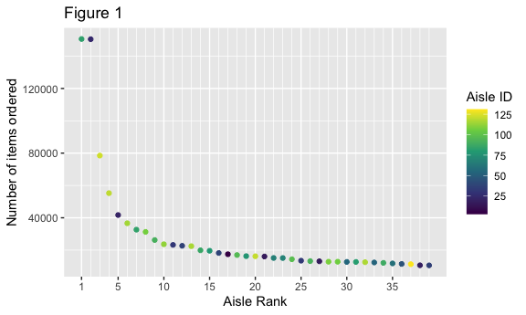

p8105\_hw3\_ml4198
================
Matthew Lawlor
10/12/2020

## Problem 1

``` r
library(p8105.datasets)
data("instacart")
```

This is a dataframe of Instacart orders with 17 variables and 1,384,617
entries. Key variables are user\_id, order\_id, product\_id, aisle\_id.

``` r
instacart %>% 
    group_by(aisle_id) %>% 
  summarize(
    n_obs = n()
    ) %>% 
  mutate(
    freq_rank = min_rank(desc(n_obs))
    ) %>% 
  filter(freq_rank < 10)
```

    ## `summarise()` ungrouping output (override with `.groups` argument)

    ## # A tibble: 9 x 3
    ##   aisle_id  n_obs freq_rank
    ##      <int>  <int>     <int>
    ## 1       21  41699         5
    ## 2       24 150473         2
    ## 3       83 150609         1
    ## 4       84  32644         7
    ## 5       91  26240         9
    ## 6      107  31269         8
    ## 7      115  36617         6
    ## 8      120  55240         4
    ## 9      123  78493         3

There are 134 aisles, and the most commonly ordered from are aisle 83
(150609 orders), 24 (150473 orders), and 123 (78493 orders).

**Code for figure 1**

``` r
instacart %>% 
    group_by(aisle_id) %>% 
  summarize(
    n_obs = n()
    ) %>% 
  mutate(
    freq_rank = min_rank(desc(n_obs))
    ) %>% 
  filter(n_obs > 10000) %>% 
  arrange(freq_rank) %>% 
  ggplot(aes(x = freq_rank, y = n_obs, color = aisle_id)) +
  geom_point() + 
  scale_x_continuous(
    breaks = c(1, 5, 10, 15, 20, 25, 30, 35),
    minor_breaks = c(1:39)) +
  labs(
    x = "Aisle Rank",
    y = "Number of items ordered",
    title = "Figure 1",
    color = "Aisle ID"
  )
```

    ## `summarise()` ungrouping output (override with `.groups` argument)



**Code for table 1**

``` r
instacart %>% 
  select(aisle, product_name) %>% 
  filter(aisle == c("baking ingredients", "dog food care", "packaged vegetables fruits")) %>% 
  group_by(aisle, product_name) %>% 
  summarize(n_obs = n()) %>% 
  arrange(aisle, desc(n_obs)) %>% 
  filter(min_rank(desc(n_obs)) < 4)
```

    ## `summarise()` regrouping output by 'aisle' (override with `.groups` argument)

    ## # A tibble: 9 x 3
    ## # Groups:   aisle [3]
    ##   aisle                      product_name                                  n_obs
    ##   <chr>                      <chr>                                         <int>
    ## 1 baking ingredients         Light Brown Sugar                               157
    ## 2 baking ingredients         Pure Baking Soda                                140
    ## 3 baking ingredients         Organic Vanilla Extract                         122
    ## 4 dog food care              Organix Grain Free Chicken & Vegetable Dog F…    14
    ## 5 dog food care              Organix Chicken & Brown Rice Recipe              13
    ## 6 dog food care              Original Dry Dog                                  9
    ## 7 packaged vegetables fruits Organic Baby Spinach                           3324
    ## 8 packaged vegetables fruits Organic Raspberries                            1920
    ## 9 packaged vegetables fruits Organic Blueberries                            1692

**Code for Table 2**

``` r
instacart %>% 
  select(order_dow, order_hour_of_day, product_name) %>% 
  filter(product_name == c("Pink Lady Apples", "Coffee Ice Cream")) %>% 
  group_by(product_name, order_dow) %>% 
  summarize(mean_hour = mean(order_hour_of_day)) %>% 
  pivot_wider(
    names_from = product_name,
    values_from = mean_hour
  ) %>% 
  knitr::kable(digits = 1)
```

    ## Warning in product_name == c("Pink Lady Apples", "Coffee Ice Cream"): longer
    ## object length is not a multiple of shorter object length

    ## `summarise()` regrouping output by 'product_name' (override with `.groups` argument)

| order\_dow | Coffee Ice Cream | Pink Lady Apples |
| ---------: | ---------------: | ---------------: |
|          0 |             13.2 |             12.2 |
|          1 |             15.0 |             11.7 |
|          2 |             15.3 |             12.0 |
|          3 |             15.4 |             13.9 |
|          4 |             15.2 |             11.9 |
|          5 |             10.3 |             13.9 |
|          6 |             12.4 |             11.6 |
